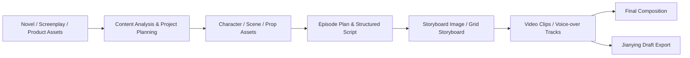

<h1 align="center">
  <br>
  <picture>
    <source media="(prefers-color-scheme: light)" srcset="frontend/public/qinshengdong-mark.svg">
    <source media="(prefers-color-scheme: dark)" srcset="frontend/public/qinshengdong-mark.svg">
    
  </picture>
  <br>
  CineForge Agent
  <br>
</h1>

<p align="center">
  <strong>AI video creation agent workspace</strong>
  <br>
  Turn novels, finished screenplays, or product assets into character-consistent, controllable, cost-trackable short videos that remain editable.
</p>

<p align="center">
  <a href="README.md"></a>
  <a href="README.en.md"></a>
</p>

<p align="center">
  <a href="LICENSE"></a>
  <a href="https://github.com/dong406/cineforge-agent"></a>
</p>

<p align="center">
  <a href="#quick-start"><strong>Quick Start</strong></a>
  ·
  <a href="https://docs.arc-reel.com/en/guide/getting-started">Getting Started</a>
  ·
  <a href="https://docs.arc-reel.com/en/">Documentation</a>
  ·
  <a href="#community">Community</a>
</p>

<p align="center">
  
</p>

## What CineForge Agent is

CineForge Agent is an agent-powered workspace for AI drama and novel adaptation, narrated short videos, ads, and product shorts. It organizes content analysis, asset management, storyboards, media generation, cost tracking, and export into an inspectable and resumable production pipeline.

- **One production workflow**: turn novels, finished screenplays, or product assets into characters, scenes, props, storyboards, video clips, and final videos step by step.
- **Visual continuity with human control**: reuse reference assets across shots, review key stages, regenerate individual assets, and roll back to earlier versions.
- **Manageable models and costs**: configure text, image, video, and TTS capabilities in one place, then review estimated costs and actual usage.
- **Editable delivery**: render final videos directly or export Jianying drafts to refine subtitles, voice-over, pacing, and transitions. Exports target the mainland-China edition of Jianying; CapCut compatibility has not been verified.

## From source to final video



Every stage can be orchestrated by the AI assistant, or reviewed, adjusted, and regenerated by the user in the workspace. See [Workflows and Modes](https://docs.arc-reel.com/en/guide/workflows) for guidance on choosing a mode.

## Quick Start

Install Docker and Docker Compose, then run:

```bash
git clone https://github.com/dong406/cineforge-agent.git
cd cineforge-agent/deploy

cp .env.example .env
docker compose up -d
```

Open <http://localhost:1241>. The default username is `admin`. If `AUTH_PASSWORD` is empty, CineForge Agent generates a password on first startup and writes it back to `deploy/.env`.

> Default Compose publishes port `1241` on all host interfaces. Do not expose CineForge Agent directly to the public Internet; before enabling remote access, configure authentication and use HTTPS, a VPN, or a secure tunnel. See [Reverse Proxy and HTTPS](https://docs.arc-reel.com/en/ops/deployment#reverse-proxy-and-https).

After signing in, open **Settings**, configure CineForge Agent and the required text, image, and video generation capabilities, then create a project.

For the complete first-run workflow, see [Getting Started](https://docs.arc-reel.com/en/guide/getting-started). For production deployment, upgrades, backups, and reverse proxies, see [Deployment and Operations](https://docs.arc-reel.com/en/ops/deployment).

## Documentation

| Page | Purpose |
|---|---|
| [Documentation Home](https://docs.arc-reel.com/en/) | Entry points for users, operators, and developers |
| [Getting Started](https://docs.arc-reel.com/en/guide/getting-started) | From first deployment to the first generated video |
| [Workflows and Modes](https://docs.arc-reel.com/en/guide/workflows) | Novels, scripts, and creative ideas; three creation types and two generation modes |
| [Provider Configuration](https://docs.arc-reel.com/en/guide/providers) | Selection and configuration of Agent, text, image, video, and TTS providers |
| [Jianying Draft Export](https://docs.arc-reel.com/en/guide/jianying-export) | Continue editing CineForge Agent output in Jianying |
| [FAQ](https://docs.arc-reel.com/en/guide/faq) | Deployment, cost, model, data, and licensing questions |
| [Deployment and Operations](https://docs.arc-reel.com/en/ops/deployment) | SQLite, PostgreSQL, upgrades, backups, and reverse proxies |
| [Migrate from SQLite to PostgreSQL](https://docs.arc-reel.com/en/ops/migrate-to-postgres) | Data migration, verification, and rollback |
| [Architecture](https://docs.arc-reel.com/en/dev/architecture) | Agent Runtime, task queue, provider abstraction, and data layer |
| [Contributing](https://docs.arc-reel.com/en/dev/contributing) | Local development, tests, conventions, and pull requests |

## Community

Scan the QR code to join the ArcReel Feishu community for help, release updates, and workflow discussions:

<p align="center">
  
</p>

Reproducible bugs and focused feature requests are welcome in [GitHub Issues](https://github.com/ArcReel/ArcReel/issues).

## Contributing

Contributions to code, documentation, tests, provider adapters, and reproducible bug reports are welcome.

Read [CONTRIBUTING.md](CONTRIBUTING.md) before starting. After cloning the repository, install the pre-commit hooks:

```bash
uv run pre-commit install
```

## License and commercial use

CineForge Agent is based on the open-source [ArcReel](https://github.com/ArcReel/ArcReel) project and retains its upstream attribution. This repository remains licensed under the [GNU Affero General Public License v3.0](LICENSE); additional terms are available in [NOTICE](NOTICE).

For organizations that cannot use AGPL-3.0, or need commercial deployment, white-labeling, or redistribution without AGPL obligations, contact:

**support@arc-reel.com**

Upstream copyright © 2026 Pollo3470 and ArcReel contributors

---

<p align="center">
  If CineForge Agent helps your work, consider giving the project a ⭐ Star.
</p>
